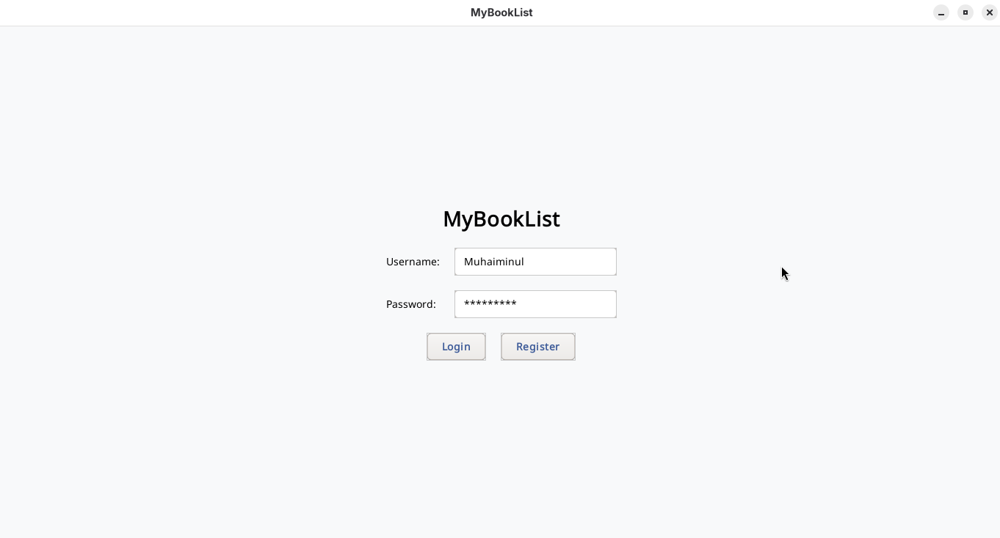
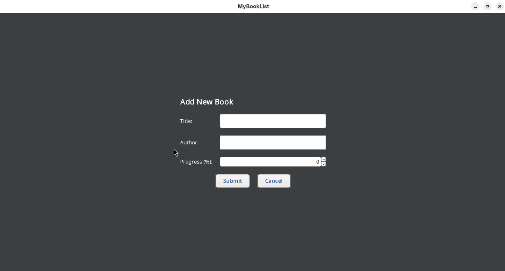
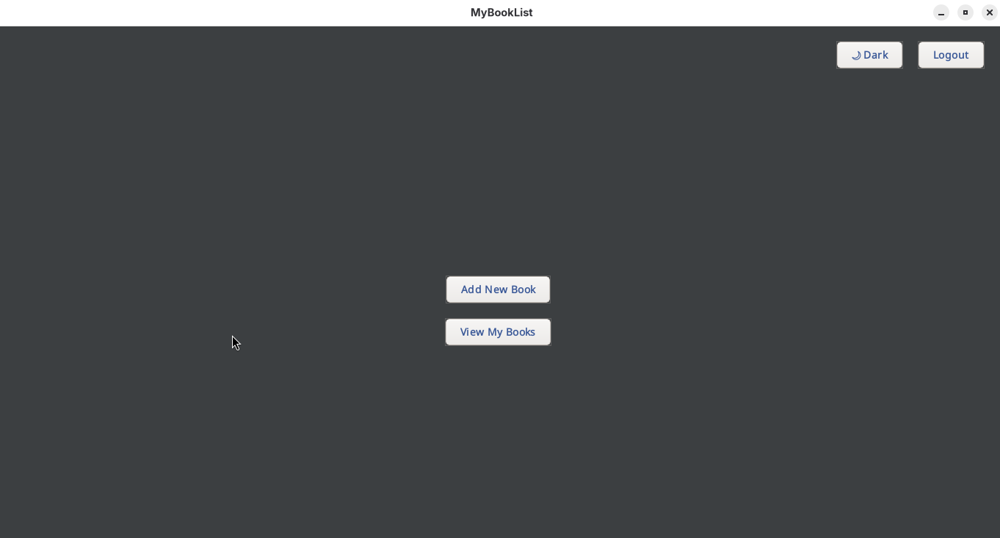
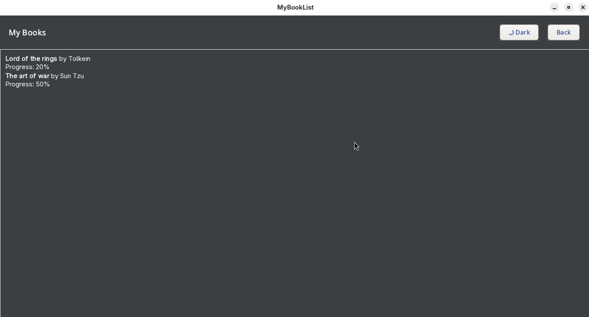

# BookTrackerApp

BookTrackerApp is a minimal and modern application for tracking your reading progress. Built with Java Swing and SQLite, it allows you to manage your personal book list in an intuitive GUI with optional dark mode and theme switching.

## Features

- **User Authentication**: Register a new account or log in to your existing account.
- **Book Management**: Add books with title, author, and track your reading progress as a percentage.
- **Book List**: View all your books and their completion status in one place.
- **Modern Minimal UI**: The interface is designed with minimalism in mind, providing easy navigation.
- **Theme Support**: Switch between light and dark modes for comfortable reading at any time.
- **Technology Stack**:
  - Java (Core Logic & UI)
  - Swing (`JFrame`) for graphical interface
  - SQLite for persistent, local database storage

## Screenshots

### Login & Registration


### Add a New Book


### Main Dashboard (Dark Mode Enabled)


### Book List


## Getting Started

1. **Clone the repository**

   ```bash
   git clone https://github.com/Sk-Muhaiminul-Hasan/BookTrackerApp.git
   ```

2. **Run the Application**

   - Make sure you have Java installed.
   - Open the project in your favorite IDE or run via command line:

   ```bash
   javac -cp ".;sqlite-jdbc-<version>.jar" src/*.java
   java -cp ".;sqlite-jdbc-<version>.jar;src" Main
   ```

   > Replace `<version>` with the actual version of your SQLite JDBC driver.

3. **Enjoy tracking your reading!**

## License

This project is licensed under the MIT License.

---

Feel free to contribute or raise any issues!
